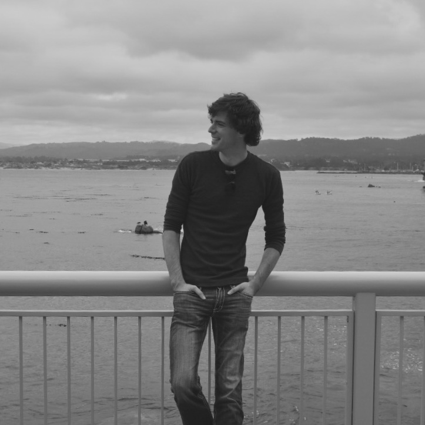

## Cluster Champions

This cluster brings together experts from architectural design practice, ML engineering, and design methods research.

[[section|slide]]

### Adam Menges, Lobe

[[section]]

As CEO of Lobe, a visual programming environment for creating neural networks, Adam currently spends the majority of his time working on technologies and tools to make machine learning easier for the masses. Previously, he worked as an engineer and contributed to the success of world class companies, such as Apple and SendGrid.

[[section|slide]]

### Kat Park, SOM

[[section]]

Kat Park directs design technology strategy at SOM. A computer scientist and architect specializing in computation design, Kat Park spearheads research initiatives to understand the role of data in performance based design, as well as explore the design and implementation of sensor systems that inform occupants' environment. As a senior designer at SOM NY, she has led the design, data management and implementation of complex geometrical systems for skyscrapers around the world. Her work at SOM NY includes World Trade Center Tower 1, Lotte Super Tower, Busan Lotte Tower, Yongsan Tower, and Digital Media City Landmark Tower in Korea, as well as research efforts that inform design processes. Kat Park has lectured and taught parametric and generative design strategies at various institutions; presented and published in ACADIA, International Journal of Architectural Computing (IJAC), International Conference on Environmental Systems (ICES), Special Interest Group in Computer Human Interaction (SIGCHI), SmartGeometry, BIM Forum and Architecture and Urbanism (A+U). Prior to SOM and architecture, she was an interdisciplinary software developer and interaction designer at Art Technology Group and MIT Media Lab. Kat Park holds a BS in Computer Science & Engineering and a Master of Architecture degree, both from MIT.

[[section|slide]]

### Kyle Steinfeld, UC Berkeley

[[section]]

Through his research and creative work, Kyle Steinfeld seeks to illuminate the dynamic relationship between the creative practice of design and computational design methods, thereby enabling a more inventive, informed, responsive, and responsible practice of architecture. He is the author of Geometric Computation: Foundations for Design and has published widely on the subject of design and computation. His recent work has specifically focused on the newly emerging topic of machine learning in design. 

In 2016, Professor Steinfeld organized and moderated a session titled Procedural Design: Machine Learning and Evaluation at the 2016 ACADIA conference in Ann Arbor. Building on the conversation that unfolded there, while speaking at the invitation of the Kuwait University College of Architecture, he offered a talk titled Fresh Eyes that drew out a number of parallels between machine learning, visual thinking, and the nature of design activity. Further developing and refining these ideas, he authored a paper for the 2017 ACADIA conference titled Dreams May Come. Here, he set out a concise theory of machine learning as it applies to creative architectural design, and offered a guide to future research at the intersection of ML and design tools. Most recently, Kyle sought to put these ideas into practice with a series of online experiments, titled Drawing with Bots, that explore a variety of potential forms and formats for the relationship between a human designer and an artificial design partner.

[[section|slide]]

### Samantha Walker, SOM

[[section]]

With a background in architecture and over ten years of experience in structural engineering, Samantha Walker promotes a collaborative, integrated approach to design. Through SOM, Samantha has acted as an advisor and reviewer for several architectural tall building studios at both the college and university levels. She sits on the board of advisors for New Story, a non-profit startup in the Bay Area that builds sustainable homes and communities in developing countries. Samantha also specializes in the design of high performance seismic protection systems, such as base isolation and dampers, and has designed structures in regions with high seismicity, including Haiti and California. She recently traveled to Mexico City with a team of colleagues in the aftermath of the September 19, 2017 earthquake to contribute to post-earthquake building reconnaissance efforts. Shortly afterwards, Samantha presented the team's findings at the EDIFICA 2017 Congress held at the Monterrey Institute of Technology and Higher Education. To enhance reconnaissance efforts, Samantha spearheaded the development of a photo recognition tool that utilizes machine learning to identify and classify damage from photographs of damaged buildings. She has a strong interest in further exploring how machine learning can influence and enhance different aspects of building design, construction and assessment. Samantha holds professional engineering licenses in both Canada and the United States and a Master of Engineering degree from McGill University.

## Cluster Participants

Can't wait for those participants!

